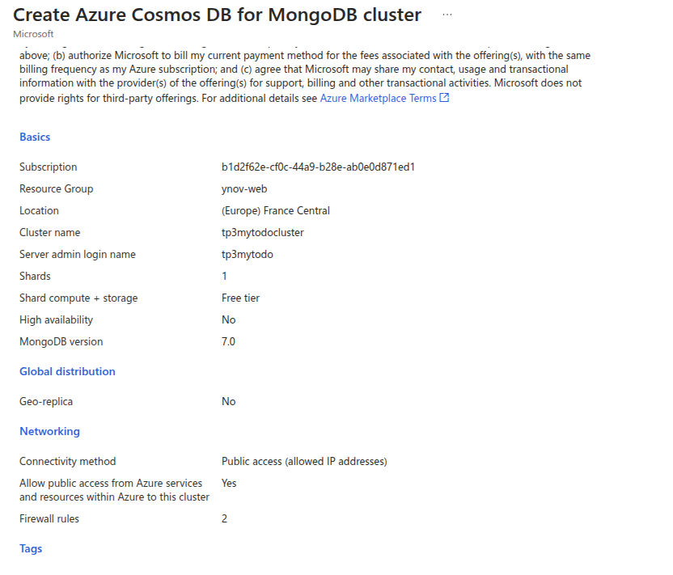
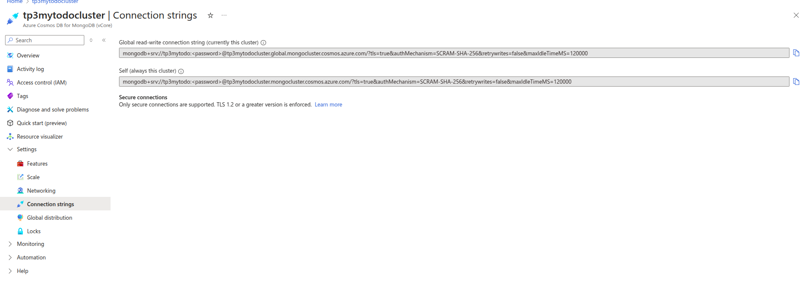
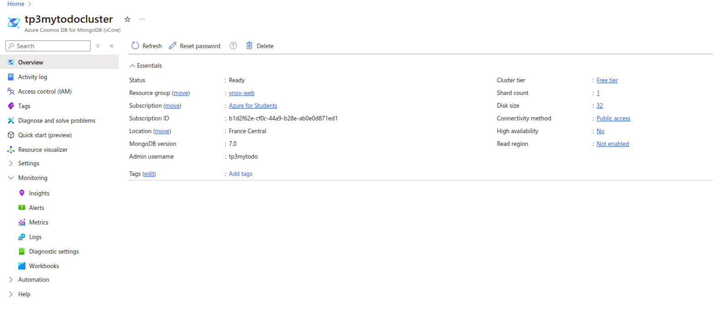
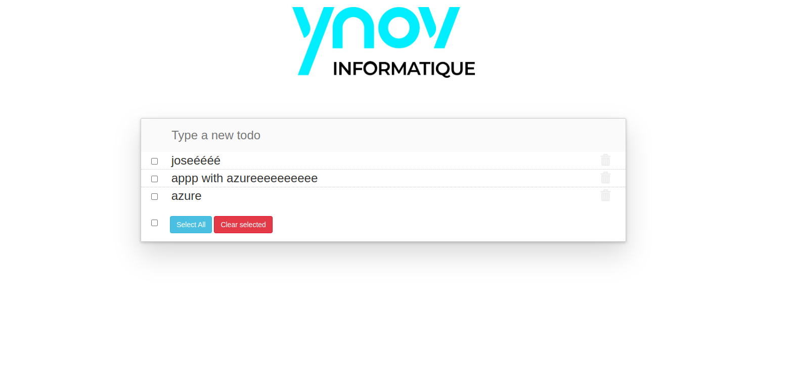

# Documentation du TP3 de Cloud - Déploiement d'une application Node.js avec MongoDB sur Scalingo

Lien de l'application: https://mytodo.osc-fr1.scalingo.io/

## 1. Configuration initiale

Avant de commencer la préparation du service, j'ai configuré un **add-on MongoDB** sur Scalingo.

Ensuite, j'ai forké le dépôt du projet et lancé le repository afin d'explorer le processus de déploiement.

## 2. Debugging initial

En consultant les logs de l'application, j'ai constaté que la base de données utilisée était une **base en mémoire** (*in-memory database*). J'ai donc commencé une phase de résolution pour connecter l'application à la base MongoDB configurée.

## 3. Utilisation de l'interface Scalingo

J'ai réalisé toutes les manipulations via **l'interface graphique** de Scalingo (et non la CLI). Cela dit, les étapes restent très similaires entre les deux méthodes.

## 4. Gestion des variables d’environnement

Afin de rendre l'application compatible avec MongoDB sur Scalingo, j’ai modifié le code pour qu’il prenne en charge les variables suivantes :

- `MONGO_URL` : URL de connexion à la base MongoDB
- `DB_NAME` : nom de la base de données
- `COLLECTION_NAME` : nom de la collection à utiliser

Ces variables sont injectées via l’interface Scalingo, dans les **variables d’environnement**.

## 5. Modifications du code

Les modifications dans le code sont restées **minimales**. L’objectif principal était de s'assurer que l’application utilise correctement les variables d’environnement au démarrage.

### `server.js`

### `db-mongo.js`

---
## 6. Application deployé

---
## 7. Intégration Bonus : MongoDB via Azure CosmosDB

Dans le cadre d’un test complémentaire, j’ai mis en place un **cluster MongoDB** à l’aide du service **Azure CosmosDB**. Pour permettre l’accès depuis Scalingo, j’ai configuré les **autorisations réseau** afin que le cluster soit exposé à l’extérieur.

J’ai ensuite mis à jour la variable d’environnement `MONGO_URL` sur Scalingo avec la **chaîne de connexion fournie par Azure**.

  

Après avoir redémarré l'application avec cette nouvelle configuration, la **connexion à CosmosDB a été établie avec succès**, et j’ai pu **recréer des données** dans la base.

---
## Conclusion

Le projet a été déployé avec succès sur Scalingo en utilisant une base MongoDB externe configurée via add-on. L'intégration s'est faite simplement grâce à la configuration des variables d'environnement et à quelques ajustements dans le code source.